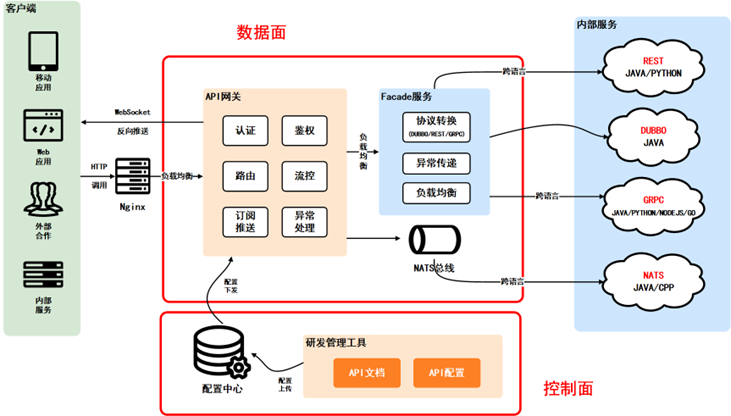

# api-gateway

项目简介：Heimdall gateway取名来自北欧神话中的守护之神，该项目总体设计参考并简化了美团 [百亿规模API网关服务Shepherd的设计与实现](https://tech.meituan.com/2021/05/20/shepherd-api-gateway.html)，旨在建设统一、轻量、透明、安全、易拓展的接入层网关。

### 控制面：
控制面由**研发管理工具DevTools**和**配置中心**两部分组成，

#### DevTools
主要负责API的创建、生成、维护等生命周期管理，同时也提供网关层面的API管控配置如登录态、权限、资源域以及校验等，并将配置下发至配置中心；
#### API网关的配置中心
选型为Apollo，其成熟的热加载能力可以支持实时推送控制面和数据面的信息交互，且具备鲁棒的failover机制。

### 数据面：
数据面即网关的核心服务，核心服务集成了一系列基础功能组件，通过泛化调用请求后端的RPC、HTTP服务，最终返回用户请求响应。
